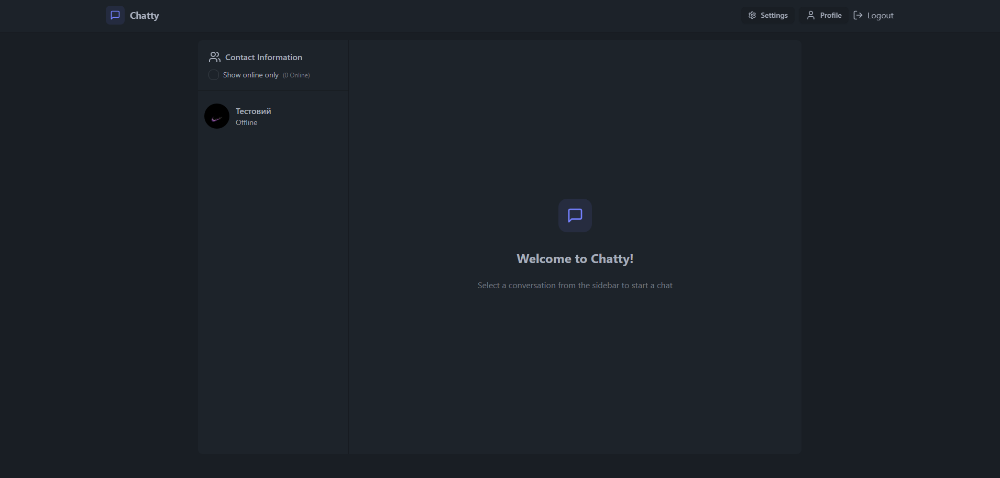
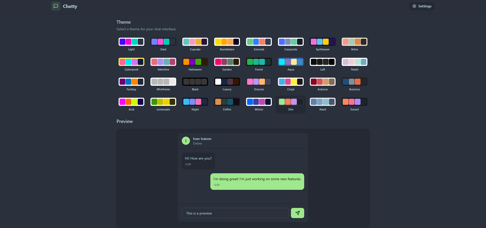
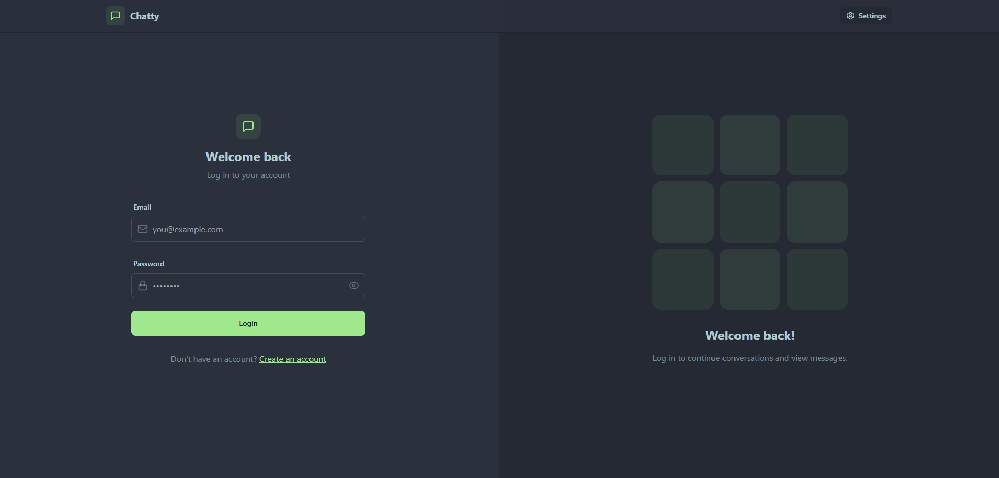
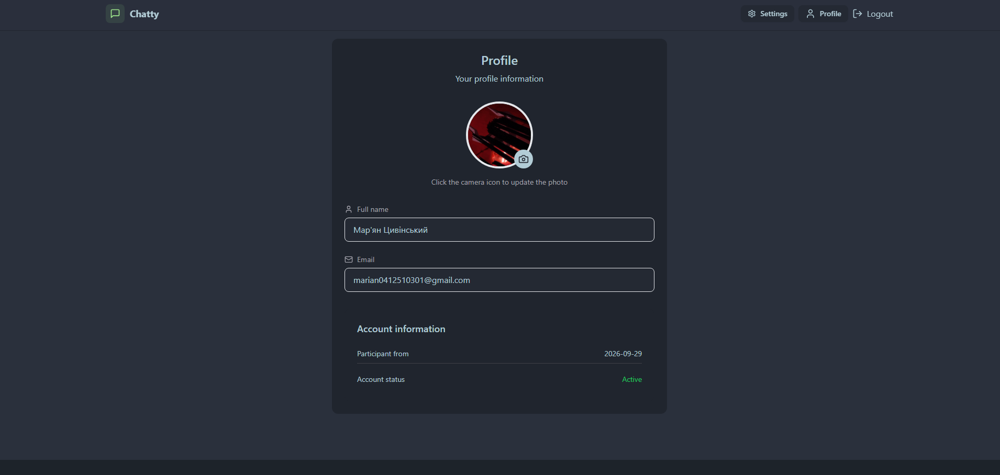

# Сhat-app

[](https://chatty-mcw0.onrender.com)
[](./LICENSE)

A decoupled full-stack real-time messaging application featuring instant bidirectional communication, media sharing, and dynamic UI theming. 

## Live app

**URL:** https://chatty-mcw0.onrender.com

## Tech stack

| Layer                  | Technologies                                                                 |
| ---------------------- | ---------------------------------------------------------------------------- |
| **Frontend Framework** | React 19, Vite                                                               |
| **Backend Framework**  | Node.js, Express                                                             |
| **Real-time Engine**   | Socket.io (Client & Server)                                                  |
| **Styling**            | TailwindCSS v3, DaisyUI                                                      |
| **Database**           | PostgreSQL (Neon Serverless), Drizzle ORM                                    |
| **Authentication**     | JSON Web Tokens (JWT), bcryptjs, cookie-parser                               |
| **State Management**   | Zustand (Global state & Persistent theme context)                            |
| **Network Requests**   | Axios                                                                        |
| **Media Storage**      | Cloudinary                                                                   |
| **Routing**            | React Router DOM v7                                                          |
| **Hosting**            | Render (Backend + Frontend via Web Service)                                  |

## Screenshots

<table>
  <tr>
    <td width="50%"></td>
    <td width="50%"></td>
  </tr>
  <tr>
    <td align="center"><sub>Real-time messaging & online status</sub></td>
    <td align="center"><sub>Dynamic DaisyUI themes (Zustand + localStorage)</sub></td>
  </tr>
  <tr>
    <td width="50%"></td>
    <td width="50%"></td>
  </tr>
  <tr>
    <td align="center"><sub>Authentication (JWT)</sub></td>
    <td align="center"><sub>Profile management & Avatar upload</sub></td>
  </tr>
</table>

## Key features

### Architecture & Backend
- **Real-Time Communication:** Instant message delivery and global online/offline user status tracking powered by Socket.io.
- **Decoupled Architecture:** Strict separation of concerns between the Vite SPA frontend and the Express REST API backend.
- **Type-Safe Database Interactions:** Schema definition and migrations handled via Drizzle ORM interacting with a Neon PostgreSQL database.
- **Secure Authentication:** Implementation of HTTP-only cookies and JWTs for session management, preventing XSS vulnerabilities.
- **Media Uploads:** Direct integration with Cloudinary for scalable image hosting and avatar management.

### Frontend & UI/UX
- **Dynamic Theming:** Users can switch between multiple color themes provided by DaisyUI. The active theme is managed via Zustand and persisted in `localStorage` to survive page reloads.
- **Pessimistic UI state:** Implemented robust state handling (`isSending` locks) to prevent accidental message duplication caused by rapid double-clicking or network latency.
- **Optimized Lifecycle:** Strict cleanup functions in React `useEffect` hooks for Socket.io event listeners to prevent memory leaks and duplicate connections.
- **Responsive Design:** Fully responsive layout ensuring a seamless chat experience across desktop and mobile devices.
- **Toast Notifications:** Real-time error handling and user feedback using `react-hot-toast`.

## Running locally

### Requirements
- Node.js 20+
- npm
- PostgreSQL database (e.g., Neon)
- Cloudinary account

### 1. Setup Backend
```bash
# Navigate to the backend directory
cd backend

# Install dependencies
npm install

# Configure environment variables (copy .env template and fill in your keys)
cp .env.example .env

# Push the Drizzle schema to your PostgreSQL database
npx drizzle-kit push

# Start the development server
npm run dev

```

The backend API and Socket.io server will run on `http://localhost:5001`.

### 2. Setup Frontend

Open a new terminal window:

```bash
# Navigate to the frontend directory
cd frontend

# Install dependencies
npm install

# Configure environment variables
cp .env.example .env

# Start the Vite development server
npm run dev

```

The frontend application will run on `http://localhost:5173`.

## Environment variables

### Backend (`backend/.env`)

```env
# Server
PORT=5001
NODE_ENV=development

# Database (PostgreSQL)
DATABASE_URL=your_neon_postgres_url

# Authentication
JWT_SECRET=your_jwt_secret_key

# Cloudinary
CLOUDINARY_CLOUD_NAME=your_cloud_name
CLOUDINARY_API_KEY=your_api_key
CLOUDINARY_API_SECRET=your_api_secret

```

## Project structure

The project is structured as a monorepo containing two decoupled applications:

```text
chat-app/
├── backend/                  ← Node.js + Express API & Socket.io server
│   ├── drizzle/              ← SQL migrations
│   ├── src/
│   │   ├── controllers/      ← Request handlers (auth, messages)
│   │   ├── lib/              ← DB schema, Cloudinary config, Socket connection
│   │   ├── middleware/       ← JWT route protection
│   │   ├── routes/           ← API endpoints definition
│   │   └── index.js          ← Entry point
│   ├── drizzle.config.js     ← Drizzle ORM configuration
│   └── package.json
│
├── frontend/                 ← React SPA (Vite)
│   ├── public/               ← Static assets
│   ├── src/
│   │   ├── components/       ← Reusable UI components & Skeletons
│   │   ├── lib/              ← Axios instance & utility functions
│   │   ├── pages/            ← Application routes (Home, Login, Profile, Settings)
│   │   ├── store/            ← Zustand global state (auth, chat, theme)
│   │   ├── App.jsx           ← Main application router & initialization
│   │   └── main.jsx          ← React DOM entry
│   ├── tailwind.config.js    ← TailwindCSS & DaisyUI configuration
│   ├── vite.config.js        ← Vite bundler configuration
│   └── package.json
│
└── README.md

```

## License

This project is distributed under the MIT License – see [LICENSE](./LICENSE) for details.